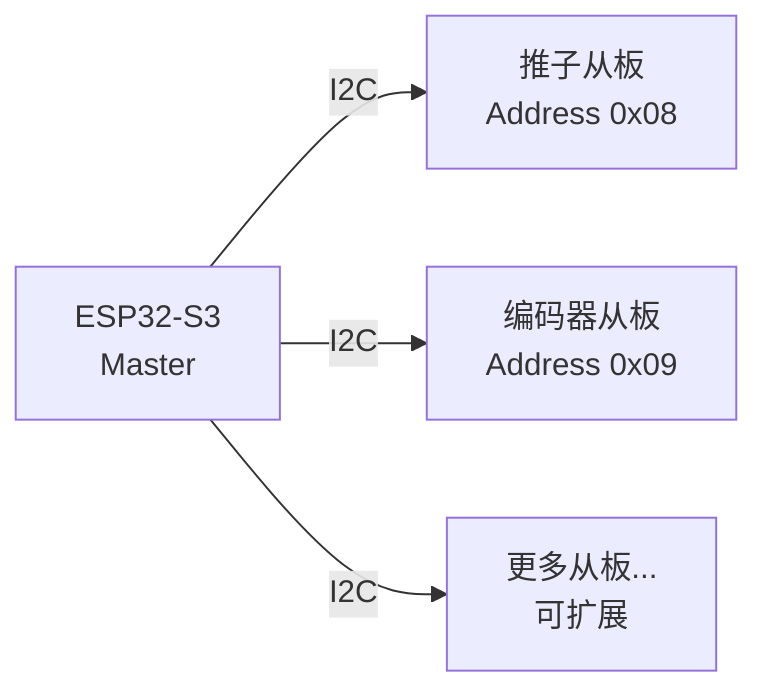
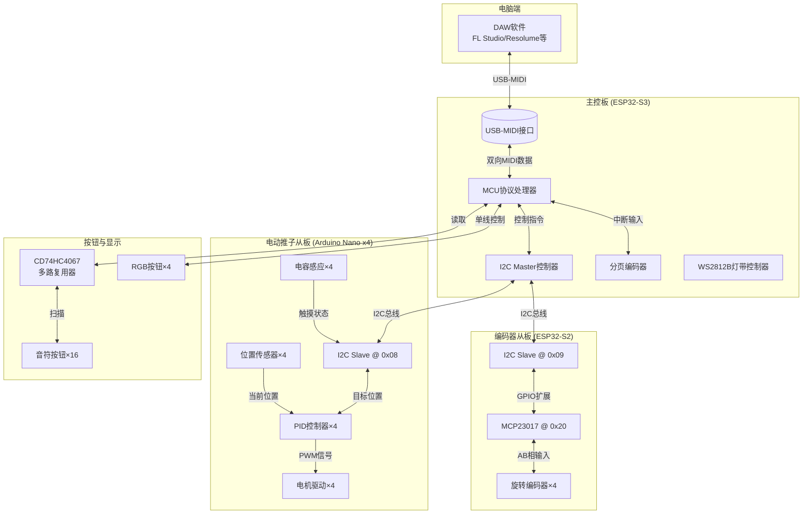
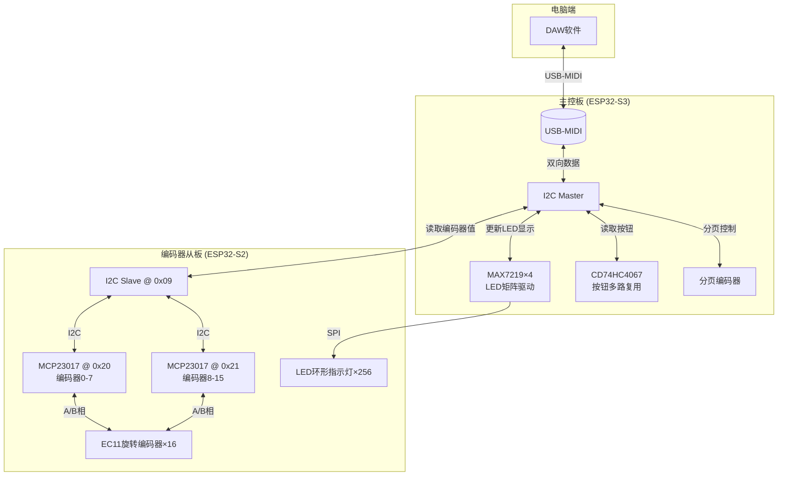

# MIDI Controller DIY Kits

> 归档一个从零到一的多通道 MIDI 控制器开源硬件项目

[](https://opensource.org/licenses/MIT)

**项目文档**: [完整制作教程与技术分析](https://your-blog-url.com/midi-controller) <!-- 替换为你的 blog 链接 -->

---

## 产品概览

本项目提供两种规格的 MIDI 控制器套件，均采用模块化设计，支持 USB-MIDI 通信，兼容主流 DAW 软件（FL Studio, Ableton Live, Reaper, Resolume Arena 等）。

> **版本说明**：项目迭代过程中曾尝试 8路电动推子版、15路VJ版等原型，因当时经验不足且精力有限，相关文档与代码未完整归档。目前**仅 4通道电动推子版**和**16路旋转编码器版**完整整理出全部需要文件。

### 4 通道电动推子版

适合音频混音、VJ 演出控制

| 规格 | 参数 |
|------|------|
| 电动推子 | 4 路，带触摸感应 |
| 旋转编码器 | 4 路，无极旋转 |
| RGB 按钮 | 4 个 |
| 分页功能 | 支持 4 组页面切换（共 64 CC 通道） |
| 主控芯片 | ESP32-S3 |
| 通信协议 | USB-MIDI + I2C |

**架构特点**：
- 主控 ESP32-S3 负责 USB-MIDI 通信
- 专用推子从板（Arduino Nano）处理 PID 电机控制
- 编码器从板（ESP32-S2）处理旋转输入
- I2C 总线连接，可扩展至 15+ 通道

 

### 16 路旋转编码器版

适合参数精细化调节、灯光控制

| 规格 | 参数 |
|------|------|
| 旋转编码器 | 16 路，带按压功能 |
| LED 环形指示灯 | 256 颗（每编码器 16 颗） |
| 分页功能 | 支持 8 组页面切换（共 128 CC 通道） |
| 主控芯片 | ESP32-S3 |
| LED 驱动 | MAX7219 × 4 |
| 通信协议 | USB-MIDI + I2C |

**架构特点**：
- 双板设计：S3 主控 + S2 编码器处理板
- MCP23017 × 2 扩展 32 路 GPIO
- 4 片 MAX7219 级联驱动 256 颗 LED

 

---

## 快速开始

### 文件结构

```
release/
├── 4_channel/           # 4通道电动推子套件
│   ├── 3d/              # 外壳 3D 模型 (.step)
│   ├── pcb/             # 电路板 Gerber 文件
│   ├── code/            # 固件代码
│   │   ├── esp32s3_standard_4pages.ino    # 主控代码
│   │   ├── Motor-Controller/              # 推子从板代码
│   │   └── 4encoder_ESP32S2/              # 编码器从板代码
│   └── 物料单.csv        # BOM 清单
│
└── 16encoder/           # 16路旋转编码器套件
    ├── 3d/              # 外壳 3D 模型
    ├── pcb/             # 电路板 Gerber 文件
    ├── code/            # 固件代码
    │   ├── 16encoder/                   # S3 主控代码
    │   └── 16encoder_ESP32S2/           # S2 编码器板代码
    └── 物料单.csv        # BOM 清单
```

### 制作流程概览

1. **下载物料**：根据 `物料单.csv` 采购元件
2. **PCB 打样**：将 `pcb/` 文件夹中的文件提交至嘉立创等平台
3. **3D 打印**：使用 `3d/` 中的 `.step` 文件打印外壳
4. **焊接组装**：按教程焊接 PCB（推荐顺序：LED → 芯片 → 主控）
5. **烧录固件**：分别上传主控和从板代码
6. **测试使用**：连接电脑，在 DAW 中配置 MIDI 映射

---

## 技术亮点

### 电动推子实现

- **PID 控制算法**：实时精准定位，消除 overshoot
- **电容触摸感应**：检测人手接触，避免电机与用户对抗
- **双向 MIDI 通信**：DAW 参数变化实时同步到物理推子位置

### 旋转编码器实现

- **速度自适应**：快速旋转时自动增加步进值
- **LED 位置指示**：16 颗 LED 组成环形，直观显示当前值
- **零延迟反馈**：I2C 从板专门处理编码器中断，主控零负担

### 可扩展架构



---

## 硬件架构图

### 4 通道版本硬件架构



### 16 旋转编码器版本架构



---

## 仓库引用

- **制作教程**：详细的焊接、烧录、调试步骤见 [Blog 文章](https://your-blog-url.com/midi-controller)
- **原理详解**：PID 算法、MIDI 协议、I2C 通信等技术分析见 [Blog 文章](https://your-blog-url.com/midi-controller)

---

## 许可

MIT License - 可自由用于个人或商业项目，修改后分发请注明原作者。

---

*本项目为个人学习与作品展示用途，不提供售后支持。DIY 有风险，焊接需谨慎。*
